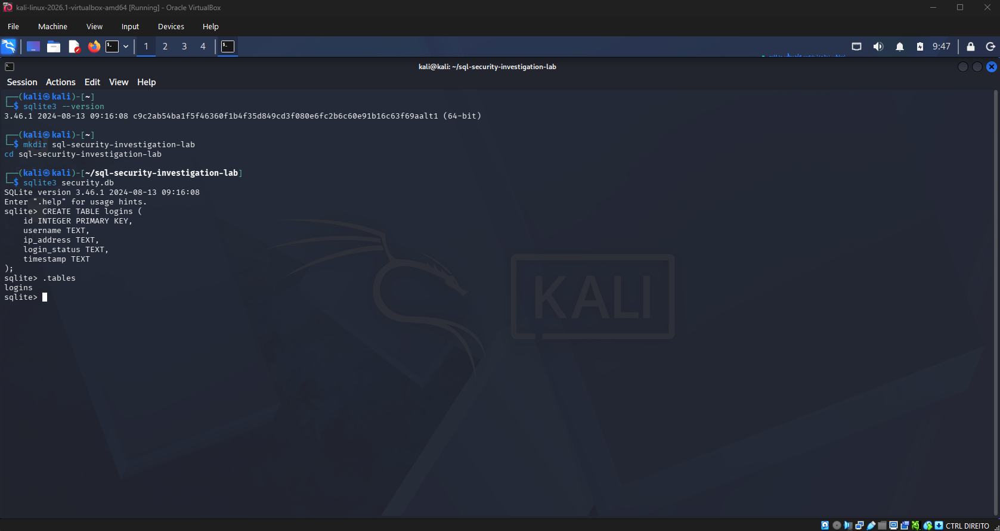
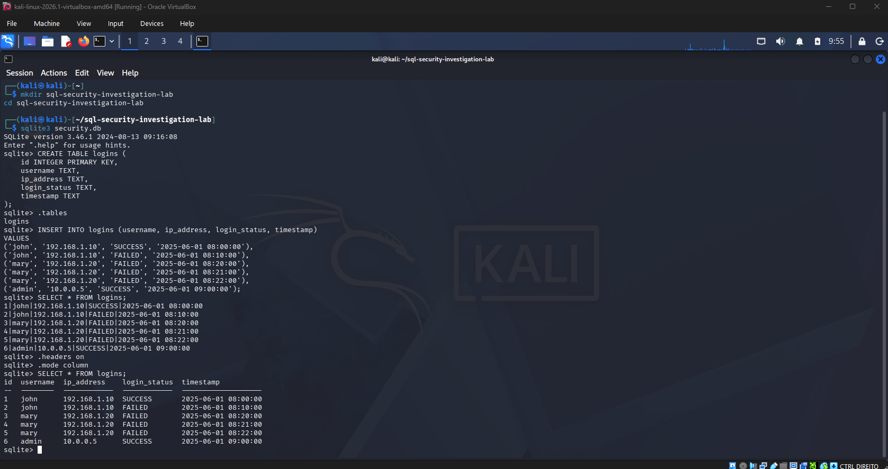
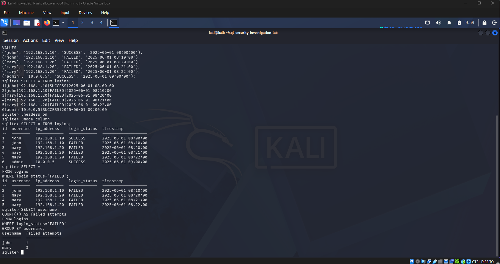
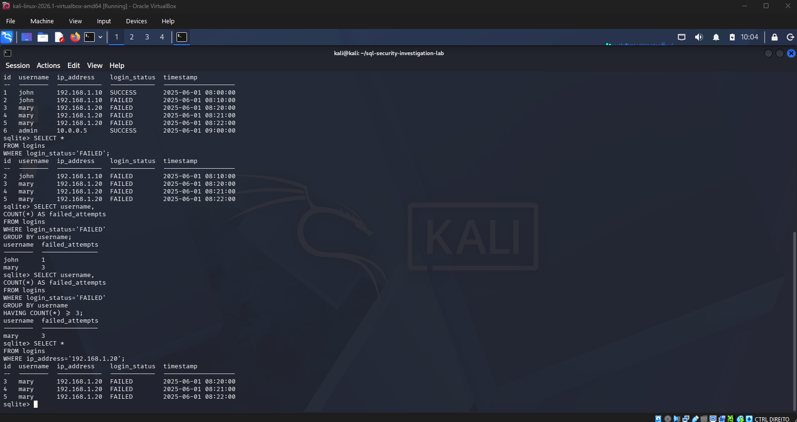

# SQL Security Investigation Lab

## Overview

This project simulates a basic security investigation using SQL. The goal was to analyze login records, identify failed login attempts, and investigate potentially suspicious activity using database queries.

## Objectives

* Create and manage a SQLite database
* Store login activity records
* Investigate failed login attempts
* Identify suspicious user behavior
* Analyze login activity by IP address
* Practice SQL queries commonly used during security investigations

## Tools Used

* Kali Linux
* SQLite3
* SQL

## Database Structure

The database contains a table named `logins` with the following fields:

* id
* username
* ip_address
* login_status
* timestamp

## Investigation Steps

### 1. Create the Login Database

A SQLite database was created and configured to store login activity records.

### 2. Insert Login Records

Sample login events were added, including both successful and failed login attempts.

### 3. Review All Login Activity

The full dataset was queried to verify that records were stored correctly.

### 4. Investigate Failed Logins

SQL queries were used to identify login attempts that resulted in failure.

### 5. Count Failed Attempts per User

Failed login attempts were grouped by username to identify unusual behavior.

### 6. Identify Suspicious Activity

A query was used to detect users with multiple failed login attempts.

### 7. Investigate Suspicious IP Addresses

Login records from suspicious IP addresses were reviewed to understand the activity.

## Screenshots

### Database Table Created

### All Login Records

### Failed Login Investigation

### Suspicious User and IP Investigation

## Skills Demonstrated

* SQL Querying
* Database Investigation
* Security Log Analysis
* Threat Hunting Fundamentals
* Data Filtering and Aggregation
* Cybersecurity Investigation Techniques

## Key Findings

The investigation identified a user account with multiple failed login attempts from the same IP address, demonstrating how SQL can be used to detect suspicious authentication activity and support security investigations.

## Author

António Pedro Silva
